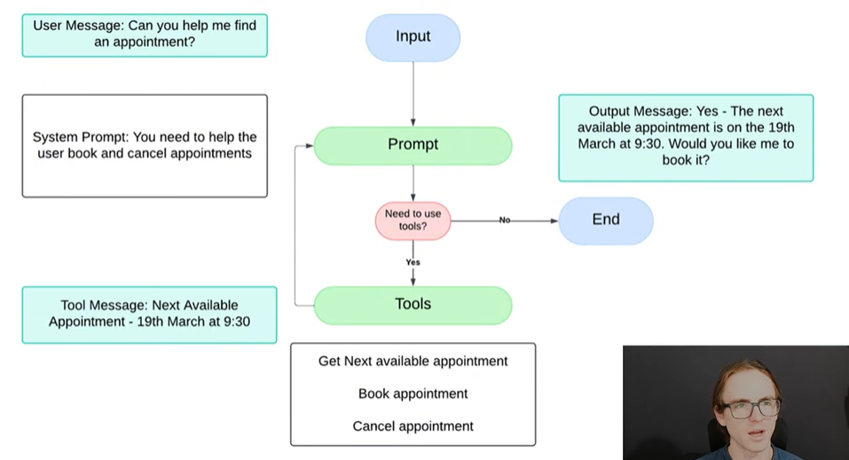

# LangGraph Tutorial

Here we are going to create an Receptionist AI Agent that can book and cancel appointments.

To run the code here you will need to install the packages listed in the requirements.txt:

```bash
pip install -r requirements.txt
```

To run the streamlit app, you can use the following command:

```bash
streamlit run streamlit_app.py
```

If you otherwise stumble on this repo, you can find the tutorial [here](https://www.youtube.com/watch?v=3Q9JY9n9f1A).

Happy Agent Building!

